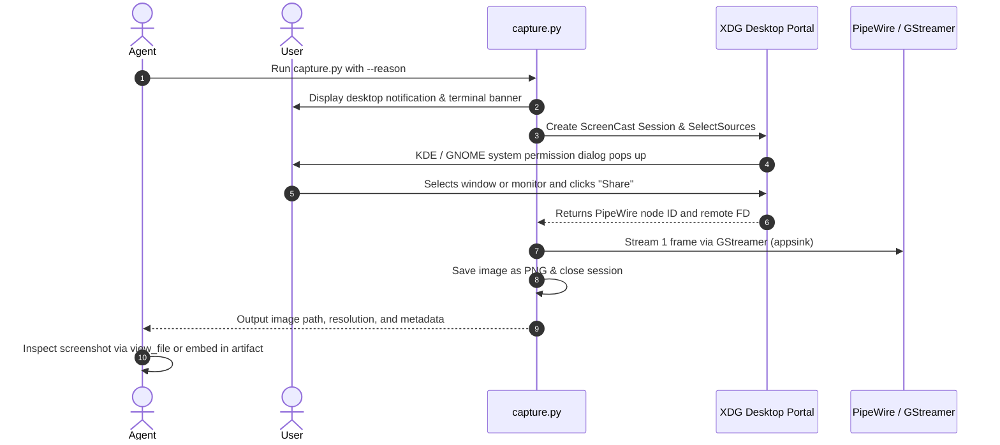

# PipeWire Screen Capture Skill

This skill allows agents to request a screen capture from the user on Linux systems (KDE Plasma, GNOME, and Wayland/X11 compositors). The capture is brokered safely and privately using **XDG Desktop Portal (`ScreenCast`)** and **PipeWire**.

## How the Flow Works



---

## When to Use This Skill

Activate this skill when:
- **Debugging GUI Applications**: Inspecting running desktop apps (Qt, GTK, Electron, SDL, Tkinter, web browsers).
- **Checking Visual Errors**: When an error dialog or graphical glitch is visible on the user's screen.
- **Verifying Layout & Styling**: Checking CSS, widgets, window placements, or responsive design.
- **User Prompts**: When the user asks "Look at my screen", "How does this look?", "See what happened", or "Take a screenshot".

---

## Agent Usage Instructions

### Step 1: Formulate the Reason
Always state clearly **what you are looking for**. This reason is displayed in the terminal and in a desktop notification so the user understands why the capture is requested.

Examples:
- `"Inspecting the layout of the user registration form in the desktop window"`
- `"Checking the error popup dialog that appeared during launch"`
- `"Verifying that the graph rendered correctly"`

### Step 2: Run the Capture Command
Run the capture script using `run_command` in bash:

```bash
python3 /home/shane/Projects/pipewire_agent_screen_image_skill/scripts/capture.py \
  --reason "Explain what you are looking for" \
  --output ./screenshots/inspect_app.png
```

Or using the bash wrapper:
```bash
/home/shane/Projects/pipewire_agent_screen_image_skill/scripts/capture.sh \
  --reason "Explain what you are looking for" \
  --output ./screenshots/inspect_app.png
```

> [!TIP]
> Use `--json` to get machine-readable output:
> ```bash
> python3 /home/shane/Projects/pipewire_agent_screen_image_skill/scripts/capture.py \
>   --reason "Verify UI changes" \
>   --json
> ```

### Step 3: Handle the Output
When the user grants access and the capture completes, the script outputs:
```json
{
  "status": "success",
  "image_path": "/home/shane/Projects/pipewire_agent_screen_image_skill/screenshots/capture_20260908_144500.png",
  "width": 1920,
  "height": 1080,
  "size_bytes": 450123,
  "reason": "Verify UI changes",
  "elapsed_seconds": 3.2
}
```

### Step 4: Inspect the Screenshot
Call `view_file` on the returned `image_path` to view and analyze the captured image:
```json
{
  "AbsolutePath": "/home/shane/Projects/pipewire_agent_screen_image_skill/screenshots/capture_20260908_144500.png",
  "toolAction": "Viewing file",
  "toolSummary": "View screen capture"
}
```

You can also embed the image in an artifact or markdown document:
```markdown

```

---

## Command Line Options

Option | Type | Default | Description
:--- | :--- | :--- | :---
`--reason`, `-r` | `string` | *(Required)* | Purpose of the screenshot; shown in notification and terminal.
`--output`, `-o` | `string` | `./screenshots/capture_<timestamp>.png` | Filepath to save the PNG screenshot.
`--source-type`, `-s` | `all`, `monitor`, `window` | `all` | Filter allowed sources in the KDE/GNOME dialog.
`--no-cursor` | flag | `False` | Omit mouse cursor from the screenshot.
`--delay`, `-d` | `float` | `0.0` | Seconds to wait before grabbing the frame after the user clicks Share.
`--timeout`, `-t` | `int` | `60` | Maximum seconds to wait for user to respond to the prompt.
`--no-notify` | flag | `False` | Suppress the desktop notification banner.
`--json` | flag | `False` | Output structured JSON instead of human-readable text.

---

## Error & Status Handling

Exit Code | Status | Cause | Recommended Agent Action
:---: | :--- | :--- | :---
`0` | Success | Frame captured and saved. | Proceed to view image via `view_file`.
`1` | Cancelled | User dismissed or clicked Cancel. | Politely ask the user if they'd like to try again or share a specific window.
`2` | Timeout | User did not click within `--timeout`. | Remind user that the system dialog timed out and ask if they are ready.
`3` | Error | D-Bus, PipeWire, or GStreamer error. | Check logs, verify desktop session is running.
